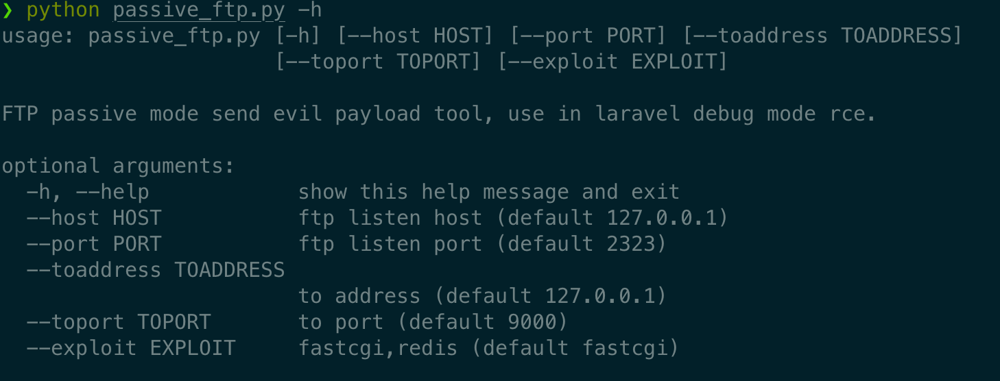
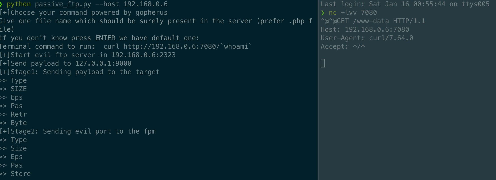

# PassiveFTP
FTP passive mode send evil payload tool, support fastcgi and redis payload (generate by gopherus)

# Usage

`python2 passive_ftp.py -h`

Laravel <=8.4.2 Debug Mode  _ignition  RCE

# Thanks

[Gopherus](https://github.com/tarunkant/Gopherus)

# Reference

[Laravel <= v8.4.2 debug mode: Remote code execution](https://www.ambionics.io/blog/laravel-debug-rce)

[hxp2020的resonator题解分析](https://www.anquanke.com/post/id/226750)